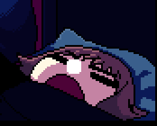

  

  

  
  
  
  

---

<h3 align="center">👨🏻‍💻 &nbsp;About Me</h3>

  

  

    🌙 &nbsp;A quiet night-learner who follows Computer Science with a calm, steady curiosity.
      
    ✨ &nbsp;Drawn to the way ideas in CS unfold—softly at first, then shaping into something real.
      
    🌧️ &nbsp;I enjoy simple, thoughtful progress, especially in Software Engineering and Data Science.
      
    🌿 &nbsp;Growing at my own pace, learning the theory while building small things that feel meaningful.
      
    ☕ &nbsp;Looking forward to the kind of progress that only comes from patient, consistent effort.
  

 

<h2 align="center">🛠️ &nbsp;Tech</h2>

  

  

     
    
    
    
    
    
    
    
     
    
    
    
    
     
    
    
    
    
    
     
    
    
    
    
     
    
    
    
    
     
    
    
    
  

 

<h2 align="center">📊 Sᴛᴀᴛs</h2>

  
  
  

<h2 align="center">🏆 Tʀᴏᴘʜɪᴇs 🏆</h2>

  <a href="https://github.com/Rusmn">
    <picture>
      <source media="(prefers-color-scheme: dark)" srcset="https://github-profile-trophy.vercel.app/?username=Rusmn&row=1&column=6&theme=tokyonight&no-bg=true&no-frame=true">
      <source media="(prefers-color-scheme: light)" srcset="https://github-profile-trophy.vercel.app/?username=Rusmn&row=1&column=6&theme=tokyonight&no-bg=true&no-frame=true">
      
    </picture>
  </a>

<h2 align="center">📈 Cᴏɴᴛʀɪʙᴜᴛɪᴏɴ Gʀᴀᴘʜ 📈</h2>

  

 

  

